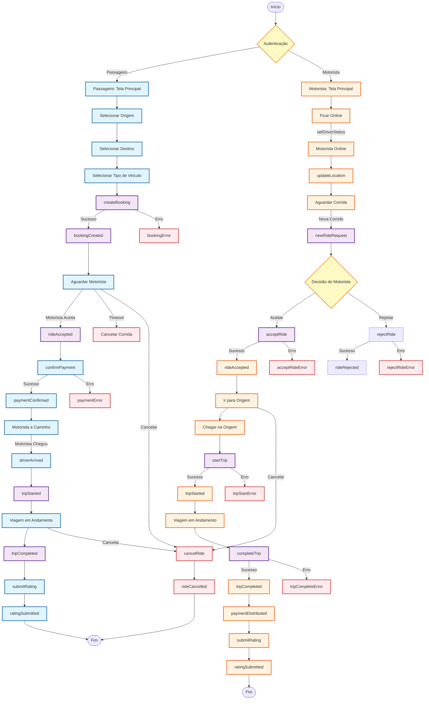
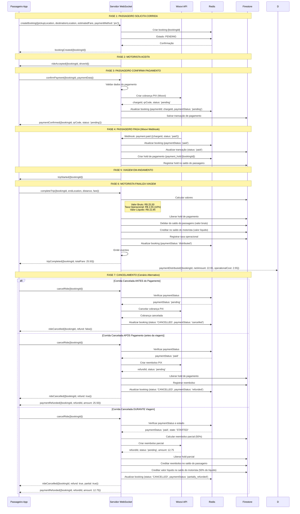
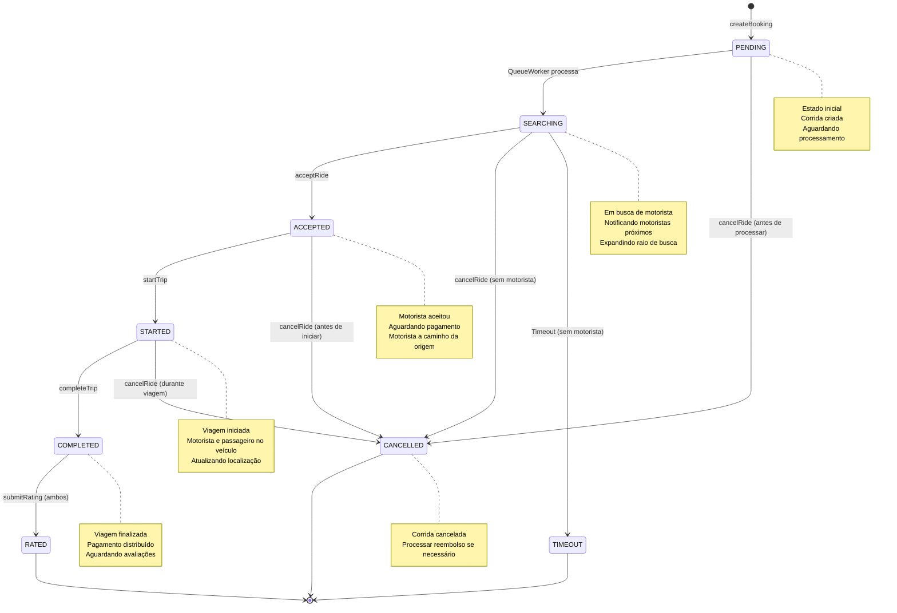
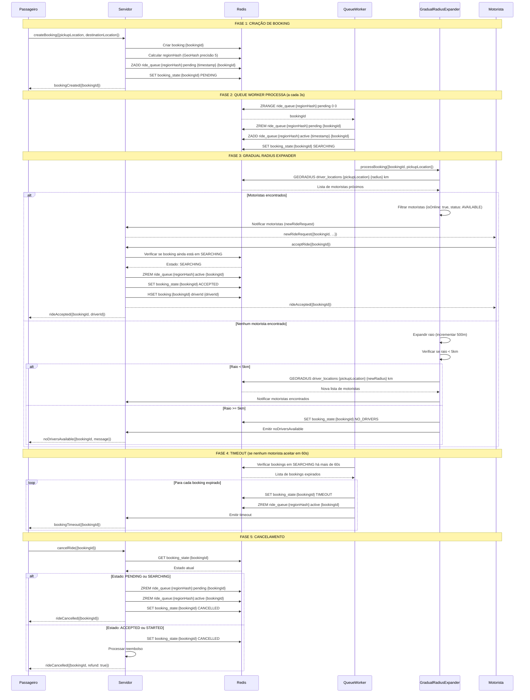
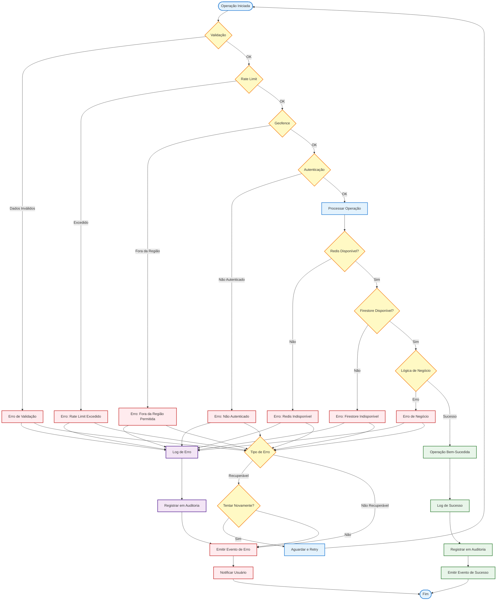

# 📊 DIAGRAMAS MERMAID - FLUXOS E INTERAÇÕES

**Data:** 2025-01-29  
**Objetivo:** Diagramas visuais dos fluxos de corrida, interações WebSocket e lógicas de decisão

---

## 📋 ÍNDICE

1. [Flowchart - Fluxo Completo de Corrida](#flowchart-fluxo-completo)
2. [Sequence Diagram - Interações WebSocket](#sequence-interacoes)
3. [Flowchart - Lógica de Decisão do Motorista](#flowchart-logica-motorista)
4. [Flowchart - Lógica de Decisão do Passageiro](#flowchart-logica-passageiro)
5. [Sequence Diagram - Fluxo de Pagamento](#sequence-pagamento)
6. [Flowchart - Estados da Corrida](#flowchart-estados)
7. [Sequence Diagram - Sistema de Filas e Matching](#sequence-filas)
8. [Flowchart - Tratamento de Erros](#flowchart-erros)

---

## 🔄 1. FLOWCHART - FLUXO COMPLETO DE CORRIDA {#flowchart-fluxo-completo}

---

## 📡 2. SEQUENCE DIAGRAM - INTERAÇÕES WEBSOCKET {#sequence-interacoes}

```mermaid
sequenceDiagram
    participant P as Passageiro App
    participant S as Servidor WebSocket
    participant R as Redis
    participant D as Motorista App
    participant Q as QueueWorker
    participant F as Firestore
    
    Note over P,F: FASE 1: AUTENTICAÇÃO
    P->>S: authenticate({uid, userType})
    S->>R: Verificar autenticação
    R-->>S: Dados do usuário
    S->>S: Registrar socket em room
    S-->>P: authenticated({uid, userType, status})
    
    Note over P,F: FASE 2: MOTORISTA FICA ONLINE
    D->>S: setDriverStatus({status: 'available', isOnline: true})
    S->>R: Salvar status do motorista
    S->>R: Adicionar ao GEO (driver_locations)
    R-->>S: Confirmação
    S-->>D: driverStatusUpdated({success: true})
    
    D->>S: updateLocation({lat, lng, heading, speed})
    S->>R: Atualizar localização no GEO
    R-->>S: Confirmação
    S-->>D: locationUpdated({success: true})
    
    Note over P,F: FASE 3: PASSAGEIRO CRIA CORRIDA
    P->>S: createBooking({pickupLocation, destinationLocation, estimatedFare, paymentMethod})
    S->>S: Validar dados (rate limit, geofence)
    S->>R: Criar booking:{bookingId}
    S->>R: Adicionar à fila regional (ride_queue:{region}:pending)
    S->>R: Atualizar estado (PENDING → SEARCHING)
    R-->>S: Confirmação
    S-->>P: bookingCreated({bookingId, status: 'SEARCHING'})
    
    Note over P,F: FASE 4: QUEUE WORKER PROCESSA
    Q->>R: Buscar próxima corrida da fila
    R-->>Q: bookingId
    Q->>R: Mover para fila ativa (ride_queue:{region}:active)
    Q->>R: Buscar motoristas próximos (GEO search)
    R-->>Q: Lista de motoristas disponíveis
    
    Note over P,F: FASE 5: NOTIFICAR MOTORISTAS
    loop Para cada motorista próximo
        Q->>S: Notificar motorista
        S->>R: Verificar se motorista está online e disponível
        R-->>S: Status do motorista
        alt Motorista disponível
            S->>S: Emitir para room driver_{driverId}
            S-->>D: newRideRequest({bookingId, pickupLocation, destinationLocation, estimatedFare, timeout: 15s})
        end
    end
    
    Note over P,F: FASE 6: MOTORISTA ACEITA
    D->>S: acceptRide({bookingId})
    S->>R: Verificar se booking ainda está disponível
    R-->>S: Status do booking
    alt Booking disponível
        S->>R: Atualizar booking (driverId, status: ACCEPTED)
        S->>R: Atualizar estado (SEARCHING → ACCEPTED)
        S->>R: Remover da fila ativa
        S->>R: Bloquear motorista (driver lock)
        R-->>S: Confirmação
        S->>S: Emitir para rooms
        S-->>D: rideAccepted({bookingId, customerId, pickupLocation})
        S-->>P: rideAccepted({bookingId, driverId, driverInfo})
    else Booking já aceito
        S-->>D: acceptRideError({error: 'Corrida já foi aceita'})
    end
    
    Note over P,F: FASE 7: PASSAGEIRO CONFIRMA PAGAMENTO
    P->>S: confirmPayment({bookingId, paymentData})
    S->>F: Processar pagamento (Woovi)
    F-->>S: Resultado do pagamento
    alt Pagamento aprovado
        S->>R: Atualizar booking (paymentStatus: CONFIRMED)
        S->>S: Emitir para rooms
        S-->>P: paymentConfirmed({bookingId, paymentId})
    else Pagamento recusado
        S-->>P: paymentError({error: 'Pagamento recusado'})
    end
    
    Note over P,F: FASE 8: MOTORISTA VAI PARA ORIGEM
    D->>S: updateLocation({lat, lng})
    S->>R: Atualizar localização
    S->>S: Calcular distância até origem
    alt Motorista chegou na origem
        S->>S: Emitir para customer room
        S-->>P: driverArrived({bookingId, driverLocation})
    end
    
    Note over P,F: FASE 9: MOTORISTA INICIA VIAGEM
    D->>S: startTrip({bookingId, startLocation})
    S->>R: Atualizar booking (status: STARTED, startLocation)
    S->>R: Atualizar estado (ACCEPTED → STARTED)
    R-->>S: Confirmação
    S->>S: Emitir para rooms
    S-->>D: tripStarted({bookingId, startTime})
    S-->>P: tripStarted({bookingId, startTime})
    
    Note over P,F: FASE 10: ATUALIZAÇÃO DE LOCALIZAÇÃO DURANTE VIAGEM
    loop Durante a viagem
        D->>S: updateTripLocation({bookingId, lat, lng})
        S->>R: Atualizar localização
        S->>S: Calcular distância até destino
        S->>S: Emitir para customer room
        S-->>P: tripLocationUpdated({bookingId, driverLocation, distanceToDestination})
    end
    
    Note over P,F: FASE 11: MOTORISTA FINALIZA VIAGEM
    D->>S: completeTrip({bookingId, endLocation, distance, fare})
    S->>R: Atualizar booking (status: COMPLETED, endLocation, distance, fare)
    S->>R: Atualizar estado (STARTED → COMPLETED)
    S->>F: Calcular valores (bruto, líquido, taxa operacional)
    S->>F: Distribuir pagamento (saldo do motorista)
    F-->>S: Pagamento distribuído
    S->>S: Emitir para rooms
    S-->>D: tripCompleted({bookingId, netAmount, operationalCost})
    S-->>P: tripCompleted({bookingId, totalFare, paymentStatus})
    
    Note over P,F: FASE 12: AVALIAÇÕES
    P->>S: submitRating({bookingId, rating, comment})
    S->>F: Salvar avaliação do passageiro
    S->>S: Emitir para driver room
    S-->>D: ratingSubmitted({bookingId, rating, comment})
    
    D->>S: submitRating({bookingId, rating, comment})
    S->>F: Salvar avaliação do motorista
    S->>S: Emitir para customer room
    S-->>P: ratingSubmitted({bookingId, rating, comment})
```

---

## 🚗 3. FLOWCHART - LÓGICA DE DECISÃO DO MOTORISTA {#flowchart-logica-motorista}

```mermaid
flowchart TD
    Start([Motorista Online]) --> WaitRide[Aguardar Corrida]
    WaitRide --> ReceiveRequest{Recebe newRideRequest?}
    ReceiveRequest -->|Sim| ShowCard[Mostrar Card de Corrida]
    ReceiveRequest -->|Não| WaitRide
    
    ShowCard --> DisplayInfo[Exibir: Origem, Destino, Valor, Distância]
    DisplayInfo --> StartTimer[Iniciar Timer 15s]
    StartTimer --> Decision{Decisão do Motorista}
    
    Decision -->|Aceitar| CheckAvailability{Disponível?}
    Decision -->|Rejeitar| RejectRide[rejectRide]
    Decision -->|Timeout| AutoReject[Rejeição Automática]
    
    CheckAvailability -->|Sim| SendAccept[acceptRide]
    CheckAvailability -->|Não| ShowError[Erro: Indisponível]
    
    SendAccept --> WaitResponse{Aguardar Resposta}
    WaitResponse -->|Sucesso| RideAccepted[rideAccepted]
    WaitResponse -->|Erro| AcceptError[acceptRideError]
    
    AcceptError -->|Corrida já aceita| WaitRide
    AcceptError -->|Outro erro| ShowErrorMsg[Mostrar Mensagem de Erro]
    ShowErrorMsg --> WaitRide
    
    RideAccepted --> LockVehicle[Bloquear Veículo]
    LockVehicle --> NavigateToPickup[Navegar para Origem]
    NavigateToPickup --> UpdateLocation[updateLocation contínuo]
    UpdateLocation --> CheckDistance{Distância até Origem}
    
    CheckDistance -->|> 100m| UpdateLocation
    CheckDistance -->|<= 100m| ArrivePickup[Chegou na Origem]
    
    ArrivePickup --> NotifyArrival[notificationAction: 'arrived']
    NotifyArrival --> WaitPassenger[Aguardar Passageiro]
    WaitPassenger --> PassengerReady{Passageiro Pronto?}
    
    PassengerReady -->|Sim| StartTrip[startTrip]
    PassengerReady -->|Não| WaitPassenger
    
    StartTrip --> WaitStartResponse{Aguardar Resposta}
    WaitStartResponse -->|Sucesso| TripStarted[tripStarted]
    WaitStartResponse -->|Erro| StartError[tripStartError]
    
    StartError --> ShowStartError[Mostrar Erro]
    ShowStartError --> StartTrip
    
    TripStarted --> UpdateTripLocation[updateTripLocation contínuo]
    UpdateTripLocation --> CheckDestination{Distância até Destino}
    
    CheckDestination -->|> 50m| UpdateTripLocation
    CheckDestination -->|<= 50m| ArriveDestination[Chegou no Destino]
    
    ArriveDestination --> CompleteTrip[completeTrip]
    CompleteTrip --> WaitCompleteResponse{Aguardar Resposta}
    WaitCompleteResponse -->|Sucesso| TripCompleted[tripCompleted]
    WaitCompleteResponse -->|Erro| CompleteError[tripCompleteError]
    
    CompleteError --> ShowCompleteError[Mostrar Erro]
    ShowCompleteError --> CompleteTrip
    
    TripCompleted --> ReceivePayment[Receber paymentDistributed]
    ReceivePayment --> ShowRating[Mostrar Modal de Avaliação]
    ShowRating --> SubmitRating[submitRating]
    SubmitRating --> RatingSubmitted[ratingSubmitted]
    RatingSubmitted --> UnlockVehicle[Desbloquear Veículo]
    UnlockVehicle --> WaitRide
    
    RejectRide --> WaitResponseReject{Aguardar Resposta}
    WaitResponseReject -->|Sucesso| RideRejected[rideRejected]
    WaitResponseReject -->|Erro| RejectError[rejectRideError]
    
    RideRejected --> WaitRide
    RejectError --> ShowRejectError[Mostrar Erro]
    ShowRejectError --> WaitRide
    
    AutoReject --> WaitRide
    
    %% CANCELAMENTO
    NavigateToPickup -->|Cancelar| CancelRide[cancelRide]
    WaitPassenger -->|Cancelar| CancelRide
    UpdateTripLocation -->|Cancelar| CancelRide
    CancelRide --> RideCancelled[rideCancelled]
    RideCancelled --> UnlockVehicle
    
    %% ESTILOS
    classDef process fill:#e3f2fd,stroke:#1976d2,stroke-width:2px
    classDef decision fill:#fff9c4,stroke:#f57f17,stroke-width:2px
    classDef event fill:#f3e5f5,stroke:#4a148c,stroke-width:2px
    classDef error fill:#ffebee,stroke:#c62828,stroke-width:2px
    classDef success fill:#e8f5e9,stroke:#2e7d32,stroke-width:2px
    
    class WaitRide,ShowCard,DisplayInfo,StartTimer,NavigateToPickup,UpdateLocation,ArrivePickup,WaitPassenger,UpdateTripLocation,ArriveDestination,ShowRating,UnlockVehicle process
    class ReceiveRequest,Decision,CheckAvailability,WaitResponse,CheckDistance,PassengerReady,WaitStartResponse,CheckDestination,WaitCompleteResponse,WaitResponseReject decision
    class RejectRide,SendAccept,RideAccepted,NotifyArrival,StartTrip,TripStarted,CompleteTrip,TripCompleted,ReceivePayment,SubmitRating,RatingSubmitted,RideRejected,CancelRide,RideCancelled event
    class AcceptError,StartError,CompleteError,RejectError,ShowError,ShowErrorMsg,ShowStartError,ShowCompleteError,ShowRejectError error
    class TripCompleted,RatingSubmitted,UnlockVehicle success
```

---

## 👤 4. FLOWCHART - LÓGICA DE DECISÃO DO PASSAGEIRO {#flowchart-logica-passageiro}

```mermaid
flowchart TD
    Start([Tela Principal]) --> SelectOrigin[Selecionar Origem]
    SelectOrigin --> SelectDest[Selecionar Destino]
    SelectDest --> SelectCarType[Selecionar Tipo de Veículo]
    SelectCarType --> ShowEstimate[Mostrar Estimativa de Preço]
    ShowEstimate --> UserDecision{Deseja Continuar?}
    
    UserDecision -->|Não| Start
    UserDecision -->|Sim| CreateBooking[createBooking]
    
    CreateBooking --> WaitBookingResponse{Aguardar Resposta}
    WaitBookingResponse -->|Sucesso| BookingCreated[bookingCreated]
    WaitBookingResponse -->|Erro| BookingError[bookingError]
    
    BookingError --> ShowBookingError[Mostrar Erro]
    ShowBookingError --> UserDecision
    
    BookingCreated --> ShowSearching[Mostrar: Buscando Motorista...]
    ShowSearching --> WaitDriver[Aguardar Motorista]
    
    WaitDriver --> CheckTimeout{Timeout?}
    CheckTimeout -->|Sim| Timeout[Cancelar Corrida]
    CheckTimeout -->|Não| CheckResponse{Recebeu Resposta?}
    
    CheckResponse -->|rideAccepted| RideAccepted[rideAccepted]
    CheckResponse -->|noDriversAvailable| NoDrivers[Sem Motoristas Disponíveis]
    CheckResponse -->|Nada| WaitDriver
    
    NoDrivers --> UserRetry{Reintentar?}
    UserRetry -->|Sim| CreateBooking
    UserRetry -->|Não| Start
    
    RideAccepted --> ShowDriverInfo[Mostrar Info do Motorista]
    ShowDriverInfo --> ShowPayment[Mostrar Tela de Pagamento]
    ShowPayment --> ProcessPayment[confirmPayment]
    
    ProcessPayment --> WaitPaymentResponse{Aguardar Resposta}
    WaitPaymentResponse -->|Sucesso| PaymentConfirmed[paymentConfirmed]
    WaitPaymentResponse -->|Erro| PaymentError[paymentError]
    
    PaymentError --> ShowPaymentError[Mostrar Erro]
    ShowPaymentError --> ShowPayment
    
    PaymentConfirmed --> DriverEnRoute[Mostrar: Motorista a Caminho]
    DriverEnRoute --> UpdateDriverLocation[Atualizar Localização do Motorista]
    UpdateDriverLocation --> CheckArrival{Motorista Chegou?}
    
    CheckArrival -->|driverArrived| DriverArrived[driverArrived]
    CheckArrival -->|Não| UpdateDriverLocation
    
    DriverArrived --> ShowArrival[Mostrar: Motorista Chegou]
    ShowArrival --> WaitStart{Aguardar Início da Viagem}
    WaitStart --> CheckStart{Recebeu tripStarted?}
    
    CheckStart -->|Sim| TripStarted[tripStarted]
    CheckStart -->|Não| WaitStart
    
    TripStarted --> ShowTrip[Mostrar: Viagem em Andamento]
    ShowTrip --> UpdateTripLocation[Atualizar Localização Durante Viagem]
    UpdateTripLocation --> CheckComplete{Recebeu tripCompleted?}
    
    CheckComplete -->|Não| UpdateTripLocation
    CheckComplete -->|Sim| TripCompleted[tripCompleted]
    
    TripCompleted --> ShowComplete[Mostrar: Viagem Finalizada]
    ShowComplete --> ShowReceipt[Mostrar Recibo]
    ShowReceipt --> ShowRating[Mostrar Modal de Avaliação]
    ShowRating --> SubmitRating[submitRating]
    
    SubmitRating --> WaitRatingResponse{Aguardar Resposta}
    WaitRatingResponse -->|Sucesso| RatingSubmitted[ratingSubmitted]
    WaitRatingResponse -->|Erro| RatingError[ratingError]
    
    RatingSubmitted --> End([Fim - Voltar para Tela Principal])
    RatingError --> ShowRatingError[Mostrar Erro]
    ShowRatingError --> ShowRating
    
    %% CANCELAMENTO
    WaitDriver -->|Cancelar| CancelRide[cancelRide]
    DriverEnRoute -->|Cancelar| CancelRide
    ShowTrip -->|Cancelar| CancelRide
    
    CancelRide --> WaitCancelResponse{Aguardar Resposta}
    WaitCancelResponse -->|Sucesso| RideCancelled[rideCancelled]
    WaitCancelResponse -->|Erro| CancelError[rideCancellationError]
    
    RideCancelled --> CheckRefund{Reembolso?}
    CheckRefund -->|Sim| PaymentRefunded[paymentRefunded]
    CheckRefund -->|Não| End
    
    PaymentRefunded --> ShowRefund[Mostrar: Reembolso Processado]
    ShowRefund --> End
    
    CancelError --> ShowCancelError[Mostrar Erro]
    ShowCancelError --> End
    
    Timeout --> CancelRide
    
    %% CHAT
    DriverEnRoute -->|Abrir Chat| OpenChat[Abrir Chat]
    ShowTrip -->|Abrir Chat| OpenChat
    OpenChat --> SendMessage[sendMessage]
    SendMessage --> ReceiveMessage[newMessage]
    ReceiveMessage --> OpenChat
    
    %% ESTILOS
    classDef process fill:#e1f5ff,stroke:#01579b,stroke-width:2px
    classDef decision fill:#fff9c4,stroke:#f57f17,stroke-width:2px
    classDef event fill:#f3e5f5,stroke:#4a148c,stroke-width:2px
    classDef error fill:#ffebee,stroke:#c62828,stroke-width:2px
    classDef success fill:#e8f5e9,stroke:#2e7d32,stroke-width:2px
    
    class SelectOrigin,SelectDest,SelectCarType,ShowEstimate,ShowSearching,WaitDriver,ShowDriverInfo,ShowPayment,DriverEnRoute,UpdateDriverLocation,ShowArrival,WaitStart,ShowTrip,UpdateTripLocation,ShowComplete,ShowReceipt,ShowRating,OpenChat process
    class UserDecision,WaitBookingResponse,CheckTimeout,CheckResponse,UserRetry,WaitPaymentResponse,CheckArrival,CheckStart,CheckComplete,WaitRatingResponse,WaitCancelResponse,CheckRefund decision
    class CreateBooking,BookingCreated,RideAccepted,ProcessPayment,PaymentConfirmed,DriverArrived,TripStarted,TripCompleted,SubmitRating,RatingSubmitted,CancelRide,RideCancelled,PaymentRefunded,SendMessage,ReceiveMessage event
    class BookingError,PaymentError,RatingError,CancelError,ShowBookingError,ShowPaymentError,ShowRatingError,ShowCancelError,Timeout,NoDrivers error
    class PaymentConfirmed,TripCompleted,RatingSubmitted,PaymentRefunded success
```

---

## 💳 5. SEQUENCE DIAGRAM - FLUXO DE PAGAMENTO {#sequence-pagamento}

---

## 🔄 6. FLOWCHART - ESTADOS DA CORRIDA {#flowchart-estados}

---

## 🎯 7. SEQUENCE DIAGRAM - SISTEMA DE FILAS E MATCHING {#sequence-filas}

---

## ⚠️ 8. FLOWCHART - TRATAMENTO DE ERROS {#flowchart-erros}

---

## 📊 9. RESUMO DOS DIAGRAMAS

### **Diagramas Criados:**

1. ✅ **Flowchart - Fluxo Completo de Corrida** - Visão geral de todo o processo
2. ✅ **Sequence Diagram - Interações WebSocket** - Detalhamento de todas as mensagens
3. ✅ **Flowchart - Lógica de Decisão do Motorista** - Fluxo completo do motorista
4. ✅ **Flowchart - Lógica de Decisão do Passageiro** - Fluxo completo do passageiro
5. ✅ **Sequence Diagram - Fluxo de Pagamento** - Processamento de pagamentos e reembolsos
6. ✅ **Flowchart - Estados da Corrida** - Máquina de estados da corrida
7. ✅ **Sequence Diagram - Sistema de Filas e Matching** - Processamento de filas e busca de motoristas
8. ✅ **Flowchart - Tratamento de Erros** - Tratamento de erros e recuperação

### **Como Usar:**

1. **Visualizar no GitHub/GitLab:** Os diagramas Mermaid são renderizados automaticamente
2. **Visualizar Online:** Copiar código para [Mermaid Live Editor](https://mermaid.live/)
3. **Integrar em Documentação:** Usar em README.md ou documentação do projeto

---

**Documento criado em:** 2025-01-29  
**Versão:** 1.0

