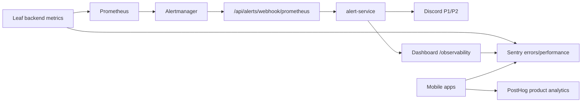

# Leaf - Stack de observabilidade para operacao solo

Data: 2026-05-11

## Decisao recomendada

Para o primeiro mes, a melhor estrutura custo/beneficio nao e Datadog completo. A estrutura mais pratica e:

1. Prometheus + Alertmanager local para metricas e regras operacionais.
2. Backend `alert-service` como hub de alertas da Leaf.
3. Discord para alerta realtime P1/P2.
4. Sentry Free para erro, stack trace, release e performance inicial do backend/dashboard/mobile.
5. PostHog para produto, funis e replay, sem ser o canal primario de incidente.
6. Grafana Cloud somente quando precisar tirar metricas da VPS ou reter historico fora da maquina.

Isso cobre a necessidade central: voce nao precisa olhar o dashboard o tempo todo. O sistema precisa chamar voce quando houver incidente.

## Arquitetura implementada



Arquivos principais:

- `docker-compose.observability.yml`: sobe Tempo, Prometheus, Alertmanager e Grafana.
- `observability/prometheus/prometheus.yml`: conecta Prometheus ao Alertmanager.
- `observability/prometheus/alert-rules.yml`: regras de infraestrutura, disponibilidade, negocio e operacao solo.
- `observability/alertmanager/alertmanager.yml`: envia alertas para o backend da Leaf.
- `leaf-websocket-backend/routes/alerts.js`: webhook publico controlado por secret.
- `leaf-websocket-backend/routes/worker-health.js`: health de workers e listagem read-only da DLQ.
- `leaf-websocket-backend/services/alert-service.js`: envia para Discord, Slack, email futuro, dashboard e log.
- `leaf-websocket-backend/config/observability-alerting.env.example`: variaveis seguras para producao.
- `leaf-dashboard-js/.env.observability.example`: variaveis futuras do dashboard para Sentry/PostHog.

## Custos estimados

Valores oficiais consultados em 2026-05-11. O valor real pode variar por billing mensal/anual, volume e regiao.

| Opcao | Custo mensal aproximado | Quando usar |
| --- | ---: | --- |
| Stack minimo | US$0 | Discord + Prometheus/Alertmanager/Grafana local + Sentry Free + PostHog Free |
| Piloto solo recomendado | US$0 | Comecar com Sentry Free, Discord e stack local |
| Upgrade Sentry Team | US$26 | Quando bater quota, precisar de integracoes avancadas ou mais usuarios |
| Upgrade com metricas fora da VPS | US$45 + uso | Sentry Team + Grafana Cloud Pro + Discord + PostHog Free |
| Datadog | bem maior e por uso/host | Somente quando houver time ou necessidade forte de plataforma unica |

Referencias:

- Sentry: https://sentry.io/pricing/
- Grafana Cloud: https://grafana.com/pricing/?tab=free
- PostHog: https://posthog.com/pricing
- Datadog: https://www.datadoghq.com/pricing/list/
- Discord webhooks: https://docs.discord.com/developers/platform/webhooks

Minha recomendacao pratica atual: comecar com Sentry Free + Discord + stack local. Isso deixa o primeiro mes em US$0/mes e cobre stack trace, tracing inicial e alertas operacionais via Discord. Subir para Sentry Team quando a quota de erros virar gargalo, quando houver mais operadores ou quando integracoes avancadas forem necessarias. Se o servidor virar ponto unico de falha para metricas, subir Grafana Cloud Pro e ir para algo perto de US$45/mes + uso.

## Canais de alerta

Crie estes canais no Discord:

- `leaf-p1-incidentes`: queda de API, pagamento, corrida travada, Redis/worker critico.
- `leaf-p2-operacao`: latencia, backlog, erro elevado, degradacao.
- `leaf-digest`: resumo manual/diario, sem acordar ninguem.

Use dois webhooks:

- `DISCORD_CRITICAL_ALERT_WEBHOOK_URL`: canal P1.
- `DISCORD_ALERT_WEBHOOK_URL`: canal P2.

Para mencionar voce em P1, preencher:

```bash
DISCORD_ALERT_MENTION=<@seu_user_id>
```

## Alertas P1 obrigatorios

Estes devem acordar voce:

- `ServiceDown`: backend fora por mais de 1 minuto.
- `CriticalCommandFailureRate`: falha de comandos acima de 5%.
- `PaymentProcessingFailure`: falha em fluxo de pagamento/finalizacao de corrida.
- `CriticalRedisLatency` ou `HighRedisErrorRate`: Redis degradado.
- `NoActiveWorkers`: nenhum worker ativo.
- `RideHealthStuckDetected`: corrida travada detectada.
- `CriticalEventLoopLag`: Node.js travado/degradado.

## Alertas P2 obrigatorios

Estes podem entrar sem mencao agressiva:

- `HighCPUUsage` e `HighMemoryUsage`.
- `HighWebSocketConnections`.
- `HighEventBacklog`.
- `HighListenerLag`.
- `H3MapComputeSlow`.
- `HighErrorRate`.

## Como subir localmente

Backend em `localhost:3001`, dashboard em `localhost:3000`, Grafana em `localhost:3002`.

```bash
docker compose -f docker-compose.observability.yml up -d
```

URLs:

- Leaf dashboard: http://localhost:3000/observability
- Backend metrics: http://localhost:3001/api/metrics/prometheus
- Prometheus: http://localhost:9090
- Alertmanager: http://localhost:9093
- Grafana: http://localhost:3002

## Como testar o alerta Discord

1. Configure no backend:

```bash
DISCORD_ALERT_WEBHOOK_URL=https://discord.com/api/webhooks/...
DISCORD_CRITICAL_ALERT_WEBHOOK_URL=https://discord.com/api/webhooks/...
ALERT_COOLDOWN_MINUTES=1
```

2. Reinicie o backend.

3. Dispare um alerta manual:

```bash
curl -X POST http://localhost:3001/api/alerts/webhook/prometheus \
  -H 'Content-Type: application/json' \
  -d '{"status":"firing","alerts":[{"status":"firing","labels":{"alertname":"LeafManualTest","severity":"critical","service":"leaf-backend"},"annotations":{"summary":"Teste manual","description":"Teste de Discord/Alertmanager","threshold":"0"}}]}'
```

Resultado esperado:

- mensagem no Discord;
- alerta no historico do backend em `/api/alerts`;
- log estruturado `Alerta enviado`.

## Seguranca em producao

Para producao, use `ALERT_WEBHOOK_SECRET`.

O endpoint aceita o segredo em:

- header `x-leaf-alert-secret`;
- query param `?secret=...`;
- corpo JSON `secret`.

Preferencia: header. Se algum provedor nao suportar header, use query param somente em rota HTTPS e com secret rotacionavel.

## Quando adicionar Sentry

Ativar Sentry antes do piloto real. Ele responde perguntas que o dashboard operacional nao responde bem:

- qual erro quebrou;
- qual release introduziu;
- stack trace;
- usuario afetado;
- regressao depois de deploy;
- performance por rota/tela.

Projetos recomendados:

- `leaf-backend`;
- `leaf-dashboard`;
- `leaf-mobile`.

Sampling inicial:

```bash
SENTRY_TRACES_SAMPLE_RATE=0.05
SENTRY_PROFILES_SAMPLE_RATE=0.01
```

## Quando adicionar PostHog

PostHog entra para produto, nao para incidente P1.

Eventos minimos:

- `signup_started`;
- `signup_completed`;
- `driver_kyc_submitted`;
- `ride_quote_requested`;
- `ride_requested`;
- `driver_assigned`;
- `ride_started`;
- `ride_completed`;
- `payment_failed`;
- `support_opened`.

## Runbook de incidente solo

1. Recebeu P1 no Discord.
2. Abrir `/observability` e verificar API, WS, Redis, Workers, pagamentos e corridas travadas.
3. Se houver DLQ, abrir o `DLQ Inspector`, filtrar por tipo/erro e copiar os IDs afetados antes de qualquer reprocessamento.
4. Abrir Sentry e ver se ha erro novo agrupado por release.
5. Abrir Prometheus/Grafana se precisar confirmar metrica bruta.
6. Se for indisponibilidade, reiniciar processo ou fazer rollback conforme runbook de deploy.
7. Se for pagamento/corrida, pausar operacao afetada e registrar IDs afetados.
8. Escrever no canal `leaf-digest`: causa provavel, acao tomada, proximo check.

## O que ainda depende de credencial

A estrutura esta pronta, mas estes pontos so ficam conectados quando voce preencher as credenciais reais:

- Discord webhook P1/P2.
- Sentry DSNs dos projetos.
- PostHog project key.
- Grafana Cloud token, se optar por cloud.

Sem essas credenciais, Prometheus/Grafana/Alertmanager rodam localmente, mas o alerta externo realtime nao chega em voce.
