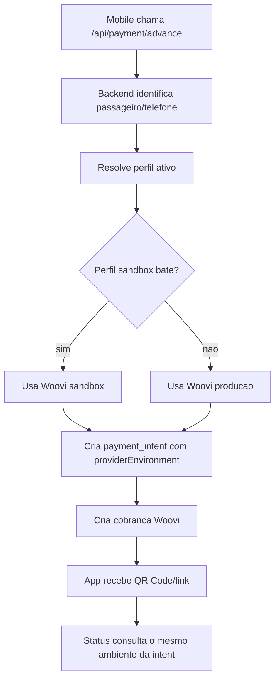

# Payment Runtime Profiles

## Objetivo

O app mobile nao escolhe mais diretamente se a Woovi roda em sandbox ou producao. O app chama o backend, e o backend resolve o ambiente de pagamento por perfil operacional.

Isso evita gerar uma nova build sempre que for necessario:

- testar uma feature com pagamento real em sandbox;
- rodar canary com usuario especifico;
- atender revisao de loja sem mudar o artefato;
- voltar para producao sem publicar update.

## Regra Padrao

Sem perfil ativo, o backend usa o ambiente padrao configurado por env:

- `WOOVI_ENVIRONMENT=production`
- `WOOVI_API_TOKEN`
- `WOOVI_BASE_URL` opcional

Para sandbox, configure credenciais separadas:

- `WOOVI_SANDBOX_API_TOKEN`
- `WOOVI_SANDBOX_CLIENT_ID` opcional
- `WOOVI_SANDBOX_CLIENT_SECRET` opcional
- `WOOVI_SANDBOX_BASE_URL` opcional

O sandbox nao reutiliza token generico de producao quando o runtime principal esta em producao.

## Dashboard

O painel `/payment-runtime` permite:

- criar perfil sandbox temporario;
- restringir por user ID, passenger ID ou telefone;
- pausar/ativar perfil;
- diagnosticar qual ambiente sera usado antes de iniciar um pagamento.

Perfis sandbox devem ter:

- expiração futura;
- duracao maxima de 24h;
- allowlist explicita;
- escopo nao global, salvo se `PAYMENT_ALLOW_GLOBAL_SANDBOX_PROFILE=true`.

## Fallback Rapido Por Env

Para smoke controlado sem dashboard, e possivel usar:

```bash
PAYMENT_SANDBOX_USER_IDS=uid_1,uid_2
PAYMENT_SANDBOX_PHONE_NUMBERS=5521999999999
PAYMENT_SANDBOX_EXPIRES_AT=2026-06-01T03:00:00.000Z
```

Sem `PAYMENT_SANDBOX_EXPIRES_AT`, o fallback e ignorado e o backend continua em producao.

## Persistencia E Idempotencia

Cada `payment_intent` grava:

- `provider`;
- `providerEnvironment`;
- `paymentProfileId`;
- `paymentProfileSource`;
- `paymentProfileReason`.

Isso impede replay cruzado entre sandbox e producao. Se uma corrida ja tem intent criada em um ambiente, uma nova tentativa com outro ambiente falha como conflito.

Ao consultar status da cobranca, o backend busca a intent pelo `chargeId` e usa o mesmo ambiente em que a cobranca nasceu.

## Fluxo



## Operacao Recomendada

1. Manter backend default em producao.
2. Criar perfil sandbox no dashboard apenas para usuarios de canary.
3. Validar com o diagnostico do painel antes de iniciar pagamento.
4. Rodar teste.
5. Pausar ou deixar expirar o perfil.

Depois do deploy inicial desta estrutura, troca sandbox/producao para canary nao exige nova build mobile.
