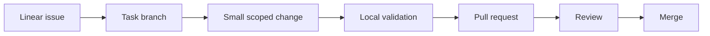

# Workflow

Este diretorio define o jeito atual de trabalhar no Leaf depois da limpeza de maio de 2026.

## Fonte da verdade

- Backlog: Linear.
- Codigo: Git, com branches por tarefa.
- Base limpa: `codex/clean-workbase-20260516`.
- Estado do projeto: [Project State](../PROJECT_STATE_2026-05-16.md).
- Validacao: [Validation Evidence](../VALIDATION_EVIDENCE_2026-05-16.md) e [Test Profile](../TEST_EXECUTION_CANONICAL_PROFILE.md).
- Canary: [Canary Test](CANARY_TEST.md).

## Ciclo de trabalho

## Documentos

- [Branching](BRANCHING.md)
- [Linear](LINEAR.md)
- [Validation Matrix](VALIDATION_MATRIX.md)
- [Release And Rollback](RELEASE_AND_ROLLBACK.md)
- [Canary Test](CANARY_TEST.md)
