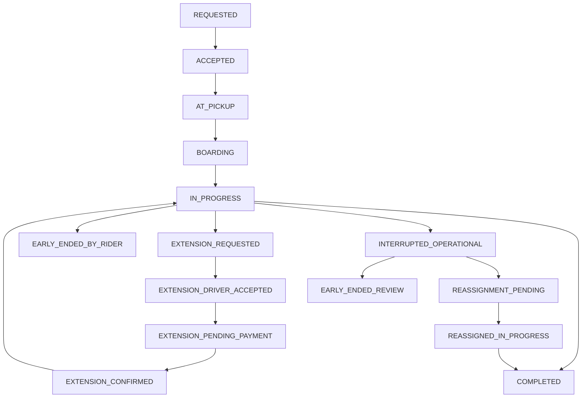

# Especificação Técnica: Extensão de Corrida, Encerramento Prematuro e Reatribuição

Data: 2026-03-28
Escopo: app passageiro, app motorista, backend WebSocket/VPS, pagamento Pix, recibo e liquidação financeira.

## 1. Contexto Fechado

Este documento formaliza as regras de negócio e a proposta técnica para o ciclo de vida da corrida a partir destas premissas:

| Item | Regra |
|---|---|
| Pagamento da corrida | 100% pré-pago via Pix antes do `startTrip` |
| Cancelamento após início | Não existe `cancelRide` após `startTrip` |
| Mudança de destino mais cara | Só via aditivo (`trip extension`) |
| Aditivo | Exige pedido do passageiro, aceite do motorista e confirmação do Pix complementar |
| Encerramento prematuro por passageiro | Calcula serviço executado + reembolso líquido |
| Interrupção operacional | Pode oferecer continuidade com outro motorista |
| Segunda perna em reassign | Plataforma absorve as taxas operacionais da segunda perna |
| Recibo | Deve refletir snapshot financeiro autoritativo do backend |

## 2. Objetivos

1. Proteger o motorista para que receba pelo serviço efetivamente prestado.
2. Tratar o passageiro de forma justa no caso de desembarque antecipado.
3. Evitar recalcular tarifa “na unha” ao final quando o modelo é pré-pago.
4. Permitir continuidade operacional da corrida quando houver problema legítimo do lado do motorista.
5. Separar claramente:
   - corrida normal
   - aditivo de corrida
   - encerramento prematuro por passageiro
   - interrupção operacional
   - encerramento em revisão

## 3. Decisões de Produto Fechadas

| Tema | Decisão |
|---|---|
| Corrida iniciada | Não pode ser cancelada |
| Destino mais caro | Não altera contrato original sem Pix complementar confirmado |
| Motorista pode recusar novo destino | Sim |
| Passageiro pede para descer antes | Corrida encerra no ponto atual |
| Reembolso no encerramento prematuro por passageiro | Sim, líquido, descontando custos não recuperáveis |
| Problema mecânico/acidente/apreensão | Passageiro pode optar por seguir com outro parceiro |
| Reassign com novo motorista | Continua a mesma corrida, com nova perna (`leg`) |
| Taxa operacional da segunda perna | Absorvida pela plataforma |

## 4. Modelo de Domínio

### 4.1 Entidade principal: Ride

Uma corrida continua sendo uma única entidade lógica para o passageiro, mesmo se houver troca de motorista.

Campos novos propostos:

```json
{
  "rideId": "ride_123",
  "status": "IN_PROGRESS",
  "totalPrepaidAmount": 45.0,
  "currency": "BRL",
  "activeDriverId": "driver_a",
  "activeLegIndex": 0,
  "legs": [],
  "extensionRequest": null,
  "finalSettlement": null
}
```

### 4.2 Estrutura de perna (`leg`)

```json
{
  "legId": "leg_1",
  "driverId": "driver_a",
  "status": "IN_PROGRESS",
  "startedAt": "2026-03-28T20:00:00.000Z",
  "endedAt": null,
  "endReason": null,
  "pickupCoordinate": { "lat": -22.90, "lng": -43.17 },
  "dropCoordinate": null,
  "distanceMeters": 0,
  "durationSec": 0,
  "grossAmount": 0,
  "operationalFee": 0,
  "paymentIntermediationFee": 0,
  "driverNetAmount": 0,
  "platformAbsorbedAmount": 0,
  "rescueBonus": 0
}
```

### 4.3 Estrutura de aditivo (`extensionRequest`)

```json
{
  "extensionId": "ext_123",
  "status": "PENDING_DRIVER",
  "requestedByPassengerId": "passenger_1",
  "requestedAt": "2026-03-28T20:10:00.000Z",
  "requestedDestination": {
    "address": "Novo destino",
    "coordinate": { "lat": -22.91, "lng": -43.18 }
  },
  "additionalDistanceMeters": 2400,
  "additionalDurationSec": 420,
  "additionalFare": 12.5,
  "driverDecisionAt": null,
  "driverDecision": null,
  "pixChargeId": null,
  "paymentStatus": null,
  "expiresAt": "2026-03-28T20:12:00.000Z"
}
```

## 5. Estados da Corrida

| Estado | Significado |
|---|---|
| `REQUESTED` | Passageiro solicitou corrida |
| `ACCEPTED` | Motorista aceitou |
| `AT_PICKUP` | Motorista registrou chegada no embarque |
| `BOARDING` | Janela de embarque ativa |
| `IN_PROGRESS` | Corrida em andamento |
| `EXTENSION_REQUESTED` | Passageiro pediu novo destino/parada |
| `EXTENSION_DRIVER_ACCEPTED` | Motorista aceitou o aditivo |
| `EXTENSION_PENDING_PAYMENT` | Aguardando Pix complementar |
| `EXTENSION_CONFIRMED` | Complemento pago, novo destino oficial |
| `EARLY_ENDED_BY_RIDER` | Passageiro encerrou antes |
| `INTERRUPTED_OPERATIONAL` | Motorista não consegue continuar |
| `REASSIGNMENT_PENDING` | Buscando novo motorista |
| `REASSIGNED_IN_PROGRESS` | Corrida retomada com outro parceiro |
| `EARLY_ENDED_REVIEW` | Encerramento excepcional em análise |
| `COMPLETED` | Corrida finalizada normalmente |

## 6. Máquina de Estados



## 7. Matriz de Cenários

| Cenário | Quem dispara | Estado final/intermediário | Motorista recebe | Passageiro paga/recebe | Plataforma absorve |
|---|---|---|---|---|---|
| Corrida normal | Fluxo normal | `COMPLETED` | Valor do serviço executado | Nada além do pré-pago | Nada |
| Mudança de destino com aumento | Passageiro + motorista + Pix | `EXTENSION_CONFIRMED` | Serviço normal até novo destino | Paga complemento | Nada |
| Motorista recusa extensão | Motorista | Continua `IN_PROGRESS` | Segue corrida original | Sem custo extra | Nada |
| Passageiro não paga extensão | Passageiro | `EXTENSION_PENDING_PAYMENT` -> expira | Segue corrida original | Sem complemento, sem novo destino | Nada |
| Passageiro pede desembarque antes | Passageiro | `EARLY_ENDED_BY_RIDER` | Valor executado | Recebe reembolso líquido | Nada |
| Problema mecânico/acidente/apreensão e passageiro quer seguir | Motorista + passageiro | `REASSIGNMENT_PENDING` -> `REASSIGNED_IN_PROGRESS` | Motorista 1: perna 1; Motorista 2: perna 2 | Mantém reserva original | Taxas operacionais da segunda perna |
| Problema mecânico/acidente/apreensão e passageiro não quer seguir | Motorista + passageiro | `INTERRUPTED_OPERATIONAL` -> encerrada | Motorista 1: perna 1 | Reembolso líquido do saldo | Nada além dos custos já incorridos |
| Incidente de segurança | Motorista/passageiro | `EARLY_ENDED_REVIEW` | Em revisão | Em revisão | Conforme análise |
| Falha técnica | Sistema | `EARLY_ENDED_REVIEW` | Em revisão | Em revisão | Conforme análise |

## 8. Motivos Permitidos

### 8.1 Encerramento prematuro por passageiro

| Código | Uso |
|---|---|
| `RIDER_REQUESTED_EARLY_DROPOFF` | Passageiro quer descer antes |
| `RIDER_CHANGED_PLANS` | Passageiro não quer mais seguir |

### 8.2 Interrupção operacional

| Código | Uso |
|---|---|
| `VEHICLE_BREAKDOWN` | Problema mecânico |
| `ACCIDENT` | Acidente |
| `POLICE_STOP_OR_SEIZURE` | Apreensão/bloqueio policial |
| `ROAD_BLOCK_NO_CONTINUATION` | Via bloqueada sem continuidade viável |
| `DRIVER_MEDICAL_ISSUE` | Motorista não pode seguir |
| `TECHNICAL_FAILURE` | Falha sistêmica impeditiva |

### 8.3 Encerramento com revisão

| Código | Uso |
|---|---|
| `SAFETY_INCIDENT` | Incidente grave de segurança |
| `RIDER_MISCONDUCT` | Conduta indevida do passageiro |
| `DRIVER_MISCONDUCT` | Conduta indevida do motorista |

## 9. Regras Financeiras

### 9.1 Corrida normal

```text
valor_final = valor_pre_pago
```

### 9.2 Extensão confirmada

```text
valor_final = valor_original + complemento_pix_confirmado
```

### 9.3 Encerramento prematuro por passageiro

```text
valor_executado = preco_base + tempo_real + distancia_real + adicionais_formalizados
custos_nao_recuperaveis = taxa_pagamento + custo_operacional_minimo + outros_custos_irrecuperaveis
reembolso = max(0, valor_pre_pago - valor_executado - custos_nao_recuperaveis)
```

### 9.4 Interrupção operacional sem continuação

```text
valor_leg_1 = servico_executado_na_perna_1
reembolso = max(0, valor_pre_pago - valor_leg_1 - custos_nao_recuperaveis_leg_1)
```

### 9.5 Interrupção operacional com continuação

```text
valor_leg_1 = servico_executado_pelo_motorista_original
valor_leg_2 = servico_executado_pelo_motorista_substituto
valor_total = valor_leg_1 + valor_leg_2
```

Regra:

- o pagamento original continua reservado na mesma corrida
- a plataforma absorve as taxas operacionais da segunda perna
- opcionalmente a plataforma pode pagar `rescueBonus` para o motorista 2
- se o saldo reservado não bastar para a continuação, isso vira caso de produto:
  - complemento explícito
  - ou absorção parcial pela plataforma

## 10. Regras de Liquidação

| Item | Regra |
|---|---|
| Motorista 1 em reassign | Recebe apenas pela perna 1 |
| Motorista 2 em reassign | Recebe apenas pela perna 2 |
| Taxa operacional da perna 2 | Absorvida pela plataforma |
| Taxa de pagamento | Tratada no consolidado da corrida |
| Recibo do passageiro | Mostra uma corrida só; pode expandir por pernas |
| Recibo do motorista | Mostra apenas sua própria perna |

## 11. Contratos de API e Socket

### 11.1 Solicitar extensão de corrida

Cliente: passageiro
Transporte: socket

Evento:

```json
{
  "event": "requestTripExtension",
  "payload": {
    "bookingId": "booking_123",
    "requestedDestination": {
      "address": "Novo destino",
      "coordinate": { "lat": -22.91, "lng": -43.18 }
    }
  }
}
```

Resposta para passageiro:

```json
{
  "event": "tripExtensionRequested",
  "payload": {
    "bookingId": "booking_123",
    "extensionId": "ext_123",
    "status": "PENDING_DRIVER",
    "expiresAt": "2026-03-28T20:12:00.000Z"
  }
}
```

Push/socket para motorista:

```json
{
  "event": "tripExtensionDecisionRequested",
  "payload": {
    "bookingId": "booking_123",
    "extensionId": "ext_123",
    "requestedDestination": {
      "address": "Novo destino",
      "coordinate": { "lat": -22.91, "lng": -43.18 }
    },
    "additionalDistanceMeters": 2400,
    "additionalDurationSec": 420,
    "additionalFare": 12.5
  }
}
```

### 11.2 Aceitar ou recusar extensão

Cliente: motorista
Transporte: socket

```json
{
  "event": "decideTripExtension",
  "payload": {
    "bookingId": "booking_123",
    "extensionId": "ext_123",
    "decision": "accept"
  }
}
```

ou

```json
{
  "event": "decideTripExtension",
  "payload": {
    "bookingId": "booking_123",
    "extensionId": "ext_123",
    "decision": "decline"
  }
}
```

Resposta quando aceita:

```json
{
  "event": "tripExtensionAccepted",
  "payload": {
    "bookingId": "booking_123",
    "extensionId": "ext_123",
    "status": "PENDING_PAYMENT",
    "additionalFare": 12.5
  }
}
```

### 11.3 Criar Pix complementar

Cliente: app passageiro
Transporte: HTTP

`POST /api/payment/trip-extension`

```json
{
  "bookingId": "booking_123",
  "extensionId": "ext_123",
  "amountInCents": 1250
}
```

Resposta:

```json
{
  "bookingId": "booking_123",
  "extensionId": "ext_123",
  "chargeId": "pix_ext_123",
  "pixQrCode": "...",
  "pixCopyPaste": "...",
  "expiresAt": "2026-03-28T20:12:00.000Z"
}
```

Quando Pix confirma:

```json
{
  "event": "tripExtensionConfirmed",
  "payload": {
    "bookingId": "booking_123",
    "extensionId": "ext_123",
    "status": "CONFIRMED",
    "newOfficialDestination": {
      "address": "Novo destino",
      "coordinate": { "lat": -22.91, "lng": -43.18 }
    },
    "additionalFare": 12.5,
    "paymentConfirmedAt": "2026-03-28T20:11:30.000Z"
  }
}
```

### 11.4 Encerrar antecipadamente por passageiro

Cliente: motorista ou passageiro, conforme UX final
Transporte: socket

```json
{
  "event": "endTripEarlyByRider",
  "payload": {
    "bookingId": "booking_123",
    "reason": "RIDER_REQUESTED_EARLY_DROPOFF",
    "endLocation": { "lat": -22.909, "lng": -43.178 },
    "notes": "Passageiro pediu para descer antes"
  }
}
```

Resposta:

```json
{
  "event": "tripEarlyEnded",
  "payload": {
    "bookingId": "booking_123",
    "status": "EARLY_ENDED_BY_RIDER",
    "financialSnapshot": {
      "prepaidAmount": 40.0,
      "executedAmount": 22.0,
      "nonRefundableCosts": 2.5,
      "refundAmount": 15.5,
      "driverNetAmount": 20.1
    }
  }
}
```

### 11.5 Interrupção operacional

Cliente: motorista
Transporte: socket

```json
{
  "event": "interruptTripOperational",
  "payload": {
    "bookingId": "booking_123",
    "reason": "VEHICLE_BREAKDOWN",
    "location": { "lat": -22.909, "lng": -43.178 },
    "notes": "Veículo perdeu tração"
  }
}
```

Resposta para passageiro:

```json
{
  "event": "tripInterruptedOperationally",
  "payload": {
    "bookingId": "booking_123",
    "reason": "VEHICLE_BREAKDOWN",
    "canContinueWithAnotherDriver": true,
    "currentLocation": { "lat": -22.909, "lng": -43.178 }
  }
}
```

### 11.6 Passageiro decide continuar com outro motorista

Cliente: passageiro
Transporte: socket

```json
{
  "event": "decideTripContinuation",
  "payload": {
    "bookingId": "booking_123",
    "decision": "continue_with_another_driver"
  }
}
```

ou

```json
{
  "event": "decideTripContinuation",
  "payload": {
    "bookingId": "booking_123",
    "decision": "end_trip_here"
  }
}
```

### 11.7 Corrida reatribuída

Push/socket para novo motorista:

```json
{
  "event": "reassignedRideRequest",
  "payload": {
    "bookingId": "booking_123",
    "legId": "leg_2",
    "currentPickup": {
      "address": "Local atual do passageiro",
      "coordinate": { "lat": -22.909, "lng": -43.178 }
    },
    "destination": {
      "address": "Destino final",
      "coordinate": { "lat": -22.912, "lng": -43.182 }
    },
    "estimatedRemainingFare": 18.0,
    "rescueBonus": 3.0
  }
}
```

## 12. Regras de UI

### 12.1 Passageiro

| Cenário | UX |
|---|---|
| Extensão | Solicita novo destino; aguarda aceite do motorista; se aceito, paga Pix complementar |
| Extensão aceita, Pix pendente | Banner: `Aguardando pagamento do complemento` |
| Encerramento por escolha própria | Modal de confirmação com aviso de reembolso líquido |
| Interrupção operacional | Modal: `Deseja continuar com outro motorista parceiro?` |
| Reassign pendente | Banner: `Procurando novo motorista` |

### 12.2 Motorista

| Cenário | UX |
|---|---|
| Pedido de extensão | Modal com novo destino, km/tempo adicionais, valor complementar e botões aceitar/recusar |
| Extensão aceita, Pix pendente | Banner: `Aguardando pagamento do complemento` |
| Interrupção operacional | Modal de motivo obrigatório |
| Corrida reatribuída | Card `Continuação de corrida` com local atual do passageiro, destino e valor estimado |

## 13. Recibos

### 13.1 Recibo do passageiro

Campos mínimos:

```json
{
  "bookingId": "booking_123",
  "status": "COMPLETED",
  "prepaidAmount": 45.0,
  "extensionAmount": 12.5,
  "totalPaid": 57.5,
  "refundAmount": 0,
  "legs": [
    {
      "legId": "leg_1",
      "driverName": "Motorista 1",
      "distanceMeters": 4200,
      "durationSec": 780
    },
    {
      "legId": "leg_2",
      "driverName": "Motorista 2",
      "distanceMeters": 5600,
      "durationSec": 960
    }
  ]
}
```

### 13.2 Recibo do motorista

Cada motorista só vê sua perna:

```json
{
  "bookingId": "booking_123",
  "legId": "leg_2",
  "grossAmount": 24.0,
  "operationalFee": 0,
  "paymentIntermediationFee": 0.5,
  "rescueBonus": 3.0,
  "driverNetAmount": 26.5
}
```

## 14. Regras de Revisão Manual

Entram automaticamente em `EARLY_ENDED_REVIEW`:

1. incidente grave de segurança
2. conflito entre posição do passageiro e do motorista
3. falha técnica na confirmação de Pix complementar
4. divergência entre rota executada e rota persistida
5. caso de denúncia de conduta imprópria

Enquanto houver revisão:

- rating bloqueado
- reembolso final bloqueado
- liquidação final bloqueada ou provisória

## 15. Invariantes do Sistema

1. Após `startTrip`, `cancelRide` não é permitido.
2. Destino oficial só muda com `tripExtensionConfirmed`.
3. Sem pagamento complementar confirmado, a corrida segue para o destino original.
4. Corrida reatribuída continua sendo a mesma corrida lógica.
5. A segunda perna não gera nova cobrança integral do zero para o passageiro.
6. A plataforma absorve as taxas operacionais da segunda perna.
7. Todo recibo final de corrida real deve sair de snapshot financeiro autoritativo do backend.

## 16. Critérios de Aceite

### 16.1 Extensão

1. Passageiro solicita novo destino.
2. Motorista recusa.
3. Corrida segue normalmente para o destino original.

4. Passageiro solicita novo destino.
5. Motorista aceita.
6. Pix complementar não é pago.
7. Extensão expira.
8. Corrida segue para o destino original.

9. Passageiro solicita novo destino.
10. Motorista aceita.
11. Pix complementar confirma.
12. Destino oficial muda.
13. Navegação é atualizada.

### 16.2 Encerramento prematuro por passageiro

1. Corrida está `IN_PROGRESS`.
2. Passageiro pede encerramento antes do destino.
3. Backend calcula valor executado.
4. Backend calcula custos não recuperáveis.
5. Backend calcula reembolso líquido.
6. Recibo reflete exatamente esses valores.

### 16.3 Reassign

1. Corrida está `IN_PROGRESS`.
2. Motorista dispara `interruptTripOperational`.
3. Passageiro opta por continuar.
4. Novo motorista aceita.
5. Corrida segue na perna 2.
6. Recibo final do passageiro mostra uma corrida única.
7. Motorista 1 recebe apenas sua perna.
8. Motorista 2 recebe apenas sua perna.

## 17. Ordem Recomendada de Implementação

1. `endTripEarlyByRider`
2. `requestTripExtension`
3. `decideTripExtension`
4. `POST /api/payment/trip-extension`
5. `tripExtensionConfirmed`
6. `interruptTripOperational`
7. `decideTripContinuation`
8. `reassignedRideRequest`
9. `EARLY_ENDED_REVIEW`

## 18. Impacto em Arquitetura Atual

Backend:

- novos comandos/handlers para extensão, encerramento prematuro e interrupção operacional
- nova modelagem de `legs`
- novo snapshot financeiro final com suporte a múltiplas pernas

Mobile:

- banners e modais para extensão
- chooser passageiro para continuidade com novo motorista
- suporte a recibo com pernas

Financeiro:

- split por perna
- reembolso líquido automático em `EARLY_ENDED_BY_RIDER`
- absorção de taxa operacional da segunda perna pela plataforma

## 19. Follow-ups Técnicos

1. Formalizar persistência de `legs` em Redis e Firestore.
2. Implementar serviço de cálculo unificado:
   - `calculateExecutedFare`
   - `calculatePassengerRefund`
   - `calculateLegSettlement`
3. Ajustar recibo para múltiplas pernas.
4. Modelar `rescueBonus` como configuração de produto.
5. Garantir trilha de auditoria para todos os motivos de interrupção e extensão.
