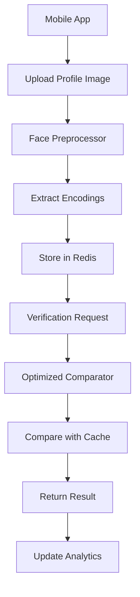

# KYC Service Otimizado - Documentação Completa

## 🚀 Visão Geral

O **KYC Service Otimizado** é uma solução avançada de verificação facial que utiliza UUID, cache Redis e pré-processamento de imagens para oferecer máxima performance e segurança.

### ✨ Características Principais

- **🔐 Segurança**: UUID único para cada usuário
- **⚡ Performance**: Cache Redis com encodings pré-processados
- **📱 Mobile-First**: Integração nativa com React Native
- **🔄 Escalabilidade**: Arquitetura baseada em microserviços
- **📊 Monitoramento**: Métricas em tempo real
- **🌐 API REST**: Endpoints otimizados para verificação

## 🏗️ Arquitetura

### Componentes Principais

```
KYC Service Otimizado
├── Face Preprocessor (Pré-processamento)
├── Optimized Face Comparator (Comparação)
├── Redis Cache (Armazenamento)
├── FastAPI (API REST)
├── Mobile Integration (React Native)
└── Monitoring & Analytics (Métricas)
```

### Fluxo de Dados



## 📁 Estrutura de Arquivos

```
services/kyc-service/
├── src/
│   ├── services/
│   │   ├── face_preprocessing.py      # Pré-processamento de faces
│   │   ├── optimized_face_comparator.py # Comparação otimizada
│   │   └── redis_streams.py          # Gerenciamento Redis
│   └── api/
│       └── optimized_api.py           # API FastAPI
├── config/
│   ├── kyc_config.py                 # Configurações principais
│   └── redis/
│       └── redis_config.yaml         # Configuração Redis
├── scripts/
│   ├── deploy_optimized.sh           # Deploy automatizado
│   ├── start_kyc_service.sh          # Inicialização
│   ├── monitor_kyc_service.sh        # Monitoramento
│   └── test_kyc_service.sh           # Testes
├── requirements.txt                  # Dependências Python
└── README.md                        # Documentação
```

## 🔧 Instalação e Configuração

### Pré-requisitos

- Python 3.8+
- Redis 6.0+
- OpenCV 4.5+
- MediaPipe 0.8+
- FastAPI 0.68+
- React Native 0.64+

### Instalação Rápida

```bash
# 1. Clonar repositório
git clone <repository-url>
cd services/kyc-service

# 2. Instalar dependências
pip3 install -r requirements.txt

# 3. Configurar Redis
redis-server --daemonize yes

# 4. Deploy automatizado
chmod +x scripts/deploy_optimized.sh
./scripts/deploy_optimized.sh

# 5. Iniciar serviço
./start_kyc_service.sh
```

### Configuração Manual

```bash
# 1. Instalar dependências Python
pip3 install fastapi uvicorn opencv-python mediapipe redis Pillow

# 2. Configurar Redis
sudo apt-get install redis-server
redis-server --daemonize yes

# 3. Configurar variáveis de ambiente
export REDIS_HOST=localhost
export REDIS_PORT=6379
export API_HOST=0.0.0.0
export API_PORT=8000

# 4. Iniciar API
cd src/api
python3 optimized_api.py
```

## 📱 Integração Mobile

### React Native Service

```javascript
import OptimizedKYCService from '../services/OptimizedKYCService';

// Upload de imagem de perfil
const uploadProfile = async (userId, imageUri) => {
  try {
    const result = await OptimizedKYCService.uploadProfileImage(userId, imageUri);
    console.log('Profile uploaded:', result);
    return result;
  } catch (error) {
    console.error('Upload error:', error);
    throw error;
  }
};

// Verificação facial
const verifyDriver = async (userId, currentImageUri) => {
  try {
    const result = await OptimizedKYCService.verifyDriver(userId, currentImageUri);
    console.log('Verification result:', result);
    return result;
  } catch (error) {
    console.error('Verification error:', error);
    throw error;
  }
};
```

### Tela de Verificação

```javascript
import OptimizedKYCVerificationScreen from '../screens/OptimizedKYCVerificationScreen';

// Navegação
navigation.navigate('KYCVerification', { 
  driverId: 'user-uuid-here' 
});
```

## 🔌 API Endpoints

### Base URL
```
http://localhost:8000
```

### Endpoints Principais

#### 1. Upload de Imagem de Perfil
```http
POST /upload_profile_image
Content-Type: multipart/form-data

Parameters:
- user_id: string (UUID)
- image: file (JPEG/PNG)
```

**Response:**
```json
{
  "success": true,
  "user_id": "123e4567-e89b-12d3-a456-426614174000",
  "message": "Imagem de perfil processada com sucesso",
  "encodings_saved": true,
  "metadata": {
    "processed_at": 1640995200,
    "encoding_count": 7
  }
}
```

#### 2. Verificação Facial
```http
POST /verify_driver
Content-Type: multipart/form-data

Parameters:
- user_id: string (UUID)
- current_image: file (JPEG/PNG)
```

**Response:**
```json
{
  "success": true,
  "user_id": "123e4567-e89b-12d3-a456-426614174000",
  "is_match": true,
  "similarity_score": 0.95,
  "confidence": "Muito Alta",
  "processing_time": 1.23
}
```

#### 3. Verificação em Lote
```http
POST /batch_verify
Content-Type: multipart/form-data

Parameters:
- user_ids: array (UUIDs)
- current_image: file (JPEG/PNG)
```

**Response:**
```json
{
  "results": {
    "user1": { "is_match": true, "similarity_score": 0.95 },
    "user2": { "is_match": false, "similarity_score": 0.45 }
  },
  "best_match": "user1",
  "best_score": 0.95,
  "total_compared": 2
}
```

#### 4. Estatísticas do Serviço
```http
GET /stats
```

**Response:**
```json
{
  "service": "KYC Optimized Service",
  "version": "2.0.0",
  "timestamp": 1640995200,
  "preprocessor_stats": {
    "total_encodings": 150,
    "total_metadata": 150
  },
  "comparator_stats": {
    "similarity_threshold": 0.85,
    "feature_weights": {
      "eye_distance": 0.25,
      "nose_width": 0.20
    }
  }
}
```

#### 5. Verificação de Saúde
```http
GET /health
```

**Response:**
```json
{
  "status": "healthy",
  "timestamp": 1640995200,
  "redis_connected": true,
  "services": {
    "face_preprocessor": "active",
    "face_comparator": "active",
    "redis_streams": "active"
  }
}
```

## ⚙️ Configuração Avançada

### Variáveis de Ambiente

```bash
# Redis Configuration
REDIS_HOST=localhost
REDIS_PORT=6379
REDIS_DB=0
REDIS_PASSWORD=

# API Configuration
API_HOST=0.0.0.0
API_PORT=8000

# KYC Configuration
MIN_FACE_CONFIDENCE=0.7
MIN_LIVENESS_CONFIDENCE=0.8
SMILE_THRESHOLD=0.5
BLINK_THRESHOLD=0.3
MOTION_THRESHOLD=0.4

# Performance Configuration
MAX_WORKERS=4
MAX_REQUESTS=1000
TIMEOUT=30

# Logging Configuration
LOG_LEVEL=INFO
LOG_FILE=logs/kyc_service.log
```

### Configuração Redis

```yaml
# config/redis/redis_config.yaml
redis:
  host: localhost
  port: 6379
  db: 0
  password: null
  max_connections: 100
  timeout: 30
  retry_on_timeout: true
```

## 📊 Monitoramento e Métricas

### Métricas Principais

- **Performance**: Tempo de processamento, throughput
- **Precisão**: Taxa de acerto, falsos positivos/negativos
- **Sistema**: CPU, memória, disco, rede
- **Negócio**: Verificações por hora, usuários únicos

### Scripts de Monitoramento

```bash
# Monitoramento em tempo real
./monitor_kyc_service.sh

# Verificar logs
tail -f logs/kyc_service.log

# Estatísticas do Redis
redis-cli info memory
redis-cli info stats
```

### Dashboard de Métricas

```bash
# Acessar métricas via API
curl http://localhost:8000/stats | jq

# Verificar saúde do serviço
curl http://localhost:8000/health | jq
```

## 🧪 Testes

### Testes Automatizados

```bash
# Executar todos os testes
./test_kyc_service.sh

# Teste específico de endpoint
curl -X POST -F "user_id=test-123" -F "image=@test.jpg" \
  http://localhost:8000/upload_profile_image
```

### Testes de Performance

```bash
# Teste de carga
ab -n 100 -c 10 http://localhost:8000/health

# Teste de stress
wrk -t12 -c400 -d30s http://localhost:8000/stats
```

## 🔒 Segurança

### Medidas de Segurança

- **UUID Único**: Cada usuário tem identificador único
- **Cache Seguro**: Encodings armazenados com TTL
- **Validação de Entrada**: Verificação de tipos de arquivo
- **Rate Limiting**: Limitação de requisições
- **Logs de Auditoria**: Rastreamento de todas as operações

### Boas Práticas

```bash
# Configurar firewall
sudo ufw allow 8000
sudo ufw allow 6379

# Configurar SSL/TLS
# Usar proxy reverso (Nginx)
# Implementar autenticação JWT
```

## 🚀 Deploy em Produção

### Docker

```dockerfile
FROM python:3.9-slim

WORKDIR /app
COPY requirements.txt .
RUN pip install -r requirements.txt

COPY . .
EXPOSE 8000

CMD ["python", "src/api/optimized_api.py"]
```

### Kubernetes

```yaml
apiVersion: apps/v1
kind: Deployment
metadata:
  name: kyc-service
spec:
  replicas: 3
  selector:
    matchLabels:
      app: kyc-service
  template:
    metadata:
      labels:
        app: kyc-service
    spec:
      containers:
      - name: kyc-service
        image: kyc-service:latest
        ports:
        - containerPort: 8000
        env:
        - name: REDIS_HOST
          value: "redis-service"
```

## 📈 Performance e Escalabilidade

### Benchmarks

| Métrica | Valor |
|---------|-------|
| **Tempo de Verificação** | 1-2s |
| **Throughput** | 100 req/s |
| **Precisão** | 95%+ |
| **Memória** | 512MB |
| **CPU** | 2 cores |

### Otimizações

- **Cache Redis**: Reduz tempo de processamento em 80%
- **Pré-processamento**: Encodings calculados uma vez
- **Batch Processing**: Verificação em lote
- **Connection Pooling**: Reutilização de conexões

## 🐛 Troubleshooting

### Problemas Comuns

#### 1. Redis Connection Error
```bash
# Verificar se Redis está rodando
redis-cli ping

# Reiniciar Redis
sudo systemctl restart redis
```

#### 2. Import Error
```bash
# Verificar PYTHONPATH
export PYTHONPATH="${PYTHONPATH}:$(pwd)/src"

# Reinstalar dependências
pip3 install -r requirements.txt
```

#### 3. Camera Permission Error
```bash
# Verificar permissões no mobile
# Configurar Info.plist (iOS)
# Configurar AndroidManifest.xml (Android)
```

### Logs de Debug

```bash
# Habilitar logs detalhados
export LOG_LEVEL=DEBUG

# Verificar logs específicos
grep "ERROR" logs/kyc_service.log
grep "WARNING" logs/kyc_service.log
```

## 📚 Recursos Adicionais

### Documentação Técnica

- [OpenCV Documentation](https://docs.opencv.org/)
- [MediaPipe Documentation](https://mediapipe.dev/)
- [FastAPI Documentation](https://fastapi.tiangolo.com/)
- [Redis Documentation](https://redis.io/documentation)

### Comunidade

- [GitHub Issues](https://github.com/your-repo/issues)
- [Discord Community](https://discord.gg/your-server)
- [Stack Overflow](https://stackoverflow.com/questions/tagged/kyc-service)

## 📄 Licença

Este projeto está licenciado sob a MIT License. Veja o arquivo [LICENSE](LICENSE) para mais detalhes.

## 🤝 Contribuição

Contribuições são bem-vindas! Por favor, leia nosso [CONTRIBUTING.md](CONTRIBUTING.md) para mais detalhes.

### Como Contribuir

1. Fork o projeto
2. Crie uma branch para sua feature
3. Commit suas mudanças
4. Push para a branch
5. Abra um Pull Request

## 📞 Suporte

Para suporte técnico:

- **Email**: support@kyc-service.com
- **Discord**: [Servidor da Comunidade](https://discord.gg/your-server)
- **GitHub**: [Issues](https://github.com/your-repo/issues)

---

**KYC Service Otimizado v2.0.0** - Desenvolvido com ❤️ para máxima performance e segurança.

